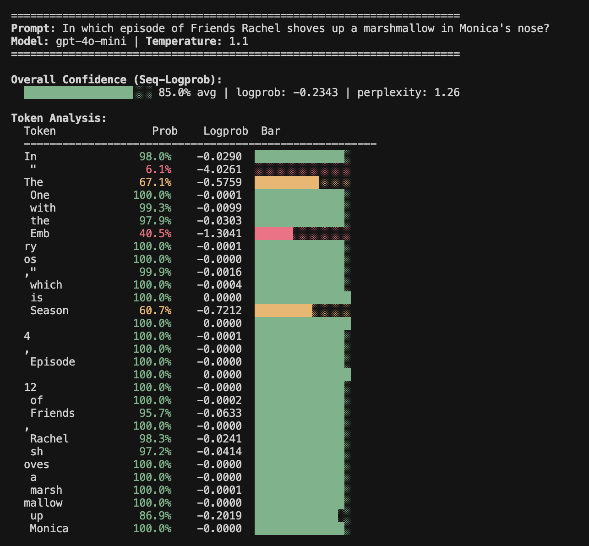

# Logprobs Explorer

Visualize OpenAI token probabilities to understand model confidence and detect potential hallucinations.

This project includes **two independent demos** that do the same thing:

| Demo | Description |
|------|-------------|
| **[Web App](https://yourusername.github.io/logprobs-demo/)** | Browser-based UI, no installation needed |
| **Python Script** | Terminal output, great for scripting |

---

## Web App

A client-side web app with a clean UI. Your API key stays in your browser.

**[→ Try it live](https://yourusername.github.io/logprobs-demo/)**

---

## Python Script

A terminal-based tool with colored output.



### Installation

```bash
pip install openai
```

### Usage

1. Set your API key in `logprobs_demo.py`:

```python
OPENAI_API_KEY = "sk-your-key-here"
```

2. Run:

```bash
python logprobs_demo.py
```

### Customization

Edit the prompt at the bottom of `logprobs_demo.py`:

```python
prompt = "Harry Potter's sister was named"
analyze_prompt(client, prompt, model="gpt-4o-mini", temperature=1)
```

---

## How It Works

Both demos request completions from OpenAI with `logprobs=True`, which returns the log-probability for each generated token—indicating how confident the model was.

### Confidence Colors

| Color | Probability | Meaning |
|-------|-------------|---------|
| 🟢 Green | > 80% | High confidence |
| 🟡 Yellow | 50-80% | Medium confidence |
| 🔴 Red | < 50% | Low confidence (potential hallucination) |

### Seq-Logprob

The sequence log-probability (Seq-Logprob) is the average of all token log-probabilities:

```
Seq-Logprob = (1/L) × Σ logprob(token_k)
```

Lower values (more negative) suggest the model is less confident, potentially indicating hallucination.

## License

MIT
